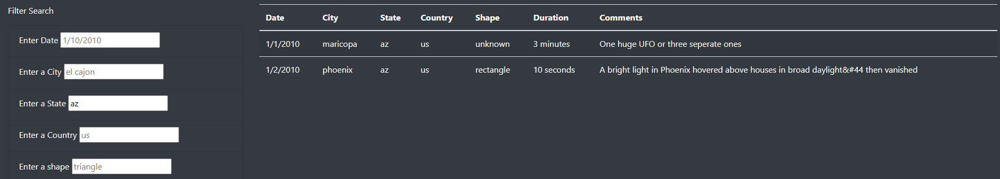

# UFO webpage

[link to deployed webpage](https://cpstell.github.io/UFOs/)

## Project Overview:

The purpose of this project is to build a UFO webpage for a hypothetical client. It consists of a dynamic table that allows users to filter on multiple criteria at the same time. 

## Software:

* Bootstrap
* HTML
* CSS
* JavaScript

## Results:

Welcome to UFO Sightings!

## The filter and its use:

##### *Above is a completed search*

To use, type in the filter over the placeholder element and press the return button. Please make sure everything is in lowercase and elimate any spaces at the end of the text. The output is a result of the various combinations of filters you chose to use.  To reset the filter simply refresh the page.

## Summary

### Drawback:

Although the filters do work, the user must know specific dates, cities, states, countries, and shapes in order for it work correctly. Also, exact spelling with everything in lowerase is a must. For example, if you type "fresno" in the city filter it will work. If you capitalize "Fresno" you will not receive an output.

### Recommendations:

To make the webpage more user friendly I would include code for allowing both upper and lower case spelling. Also, the addition of drop down menus might be usefull to allow the user to see what is searchable under each filter.  

